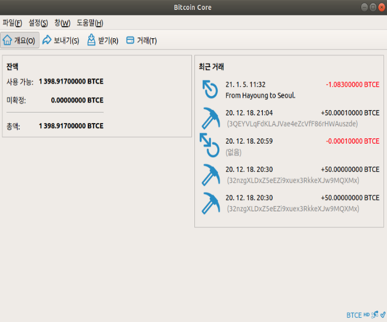

# Desktop wallet for BTC-ECC

Writer: Ha-young Park, mintyoung@gm.gist.ac.kr

Contact PI: Proof. Heung-No Lee, heungno@gist.ac.kr

Github for this example: https://github.com/cryptoecc/bitcoin_ECC

For more information: [INFONET](https://infonet.gist.ac.kr/)

## Run the bitcoin-core Qt wallet.
As we have already installed the bitcoin qt-wallet by using below command during our installation process

```shell
$ sudo apt-get install libqt5gui5 libqt5core5a libqt5dbus5 qttools5-dev qttools5-dev-tools libprotobuf-dev protobuf-compiler libqrencode-dev
```
Now run bitcoin core desktop wallet.

```shell
$ bitcoin-qt
```


