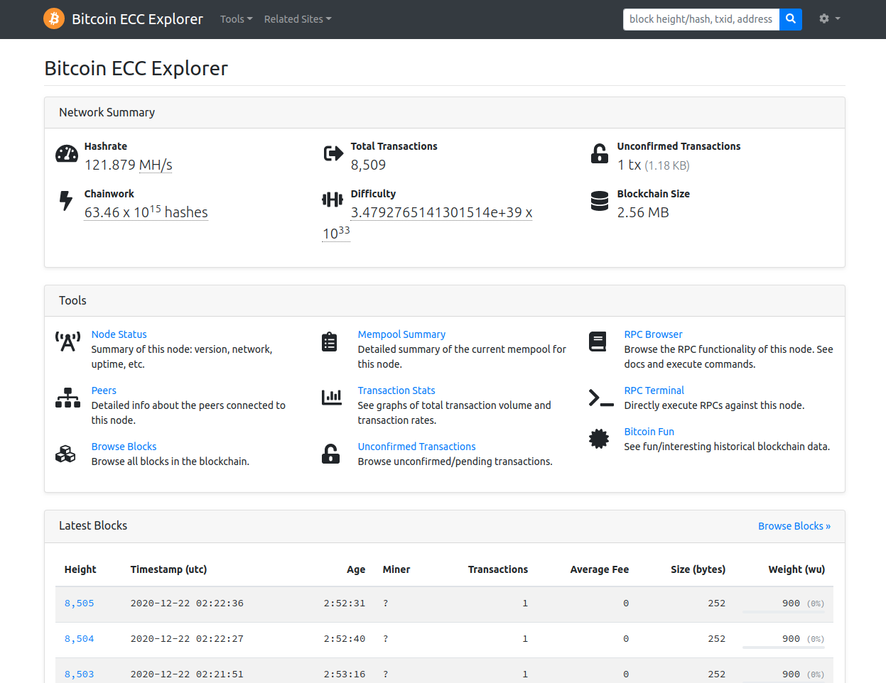

# Bitcoin ECC RPC Explorer

Writer: Ha-young Park, mintyoung@gm.gist.ac.kr

Contact PI: Proof. Heung-No Lee, heungno@gist.ac.kr

Github for this example: https://github.com/cryptoecc/bitcoin_ECC

For more information: [INFONET](https://infonet.gist.ac.kr/)




## Prerequisites

- `bitcoin-ecc` must be running.
- `npm` must be installed.

```shell
$ bitcoind -txindex -daemon
$ sudo apt-get install npm
```


## Installation

```shell
$ npm install -g bitcoin-ecc-rpc-explorer
```


## Run server

**Local access:**

```shell
$ bitcoin-ecc-rpc-explorer --port 8080 --bitcoind-port 9776
```

Access to http://127.0.0.1:8080 

<hr>

**Remote access:**

```shell
$ bitcoin-ecc-rpc-explorer --host 0.0.0.0 --port 8080 --bitcoind-port 9776
```

Access to http://<IP address>:8080 

<hr>

**Live demo available at :**

http://explorer.libervance.com:8080 