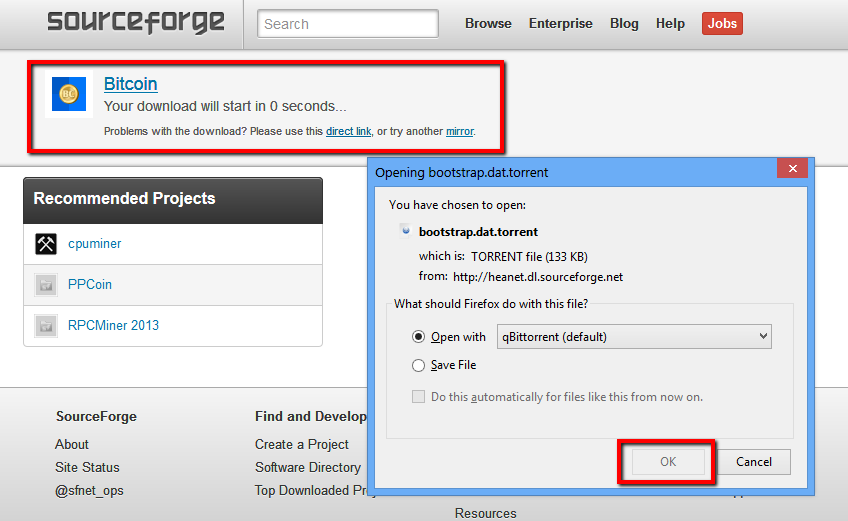
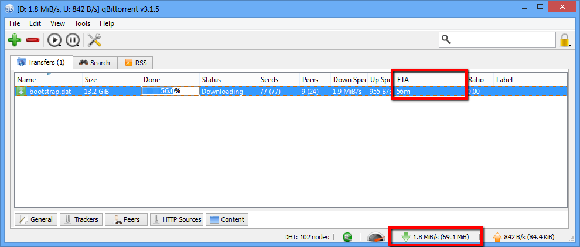
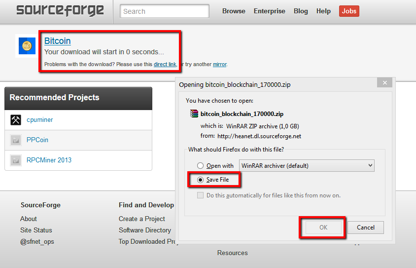
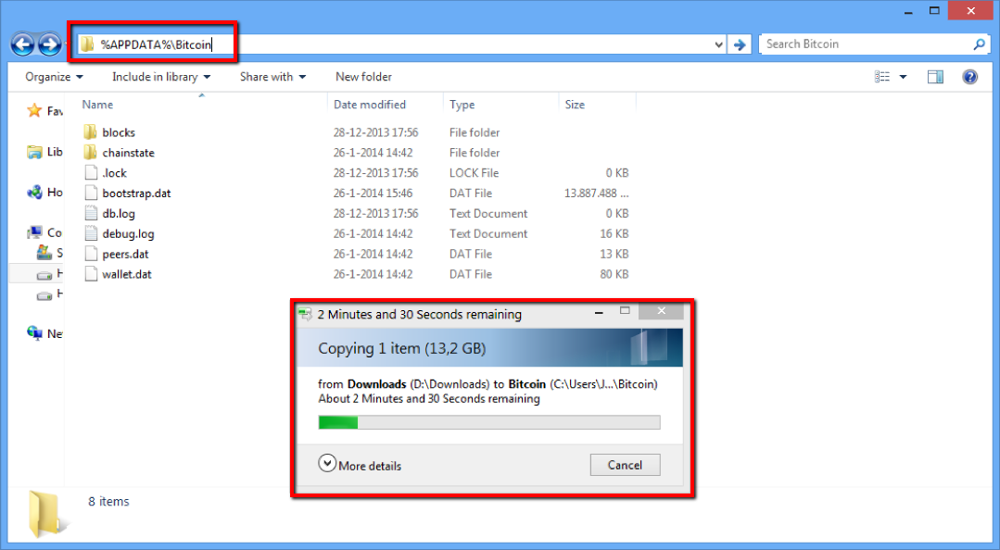

### Bootstrap the Blockchain Synchronization

Normally the Bitcoin client will download the transaction and network information, called the blockchain, from the network by syncing with the other clients. This can be a process that can take multiple days as the [Bitcoin block chain](https://blockchain.info/charts/blocks-size) has grown to more than 15 gigabytes, and is growing almost a gigabyte every month. Luckily there is a safe and fast way to speed up this process. We’ll show you how to bootstrap your blockchain to bring your client up to speed in just a few simple steps.

### Requirements

A fresh install of the Bitcoin client software.

### Download the blockchain via Bittorent

Jeff Garzik, Bitcoin core developer, offers an [torrent file](https://bitcointalk.org/index.php?topic=145386.0) for bootstrapping purposes that is updated often. Bittorrent is a protocol that speeds up the downloading of large files by using the other clients in the network. Examples of free and safe open-source clients are [Deluge](http://deluge-torrent.org/) or [QBittorent](http://www.qbittorrent.org/). A guide to installing and configuring the torrent clients can be found [here](http://dev.deluge-torrent.org/wiki/UserGuide) for Deluge and [here](http://qbforums.shiki.hu/) for QBittorent. A further in-depth tutorial on Bittorent can be found [here](http://www.howtogeek.com/howto/31846/bittorrent-for-beginners-how-get-started-downloading-torrents/).

With the client installed we’ll proceed to download the blockchain torrent file. Use the following magnet link:

	magnet:?xt=urn:btih:2d4e6c1f96c5d5fb260dff92aea4e600227f1aea&dn=bootstrap.dat&tr=udp://tracker.openbittorrent.com:80&tr=udp://tracker.publicbt.com:80&tr=udp://tracker.ccc.de:80&tr=udp://tracker.istole.it:80
	
 or go to [Jeff Garzik's topic](https://bitcointalk.org/index.php?topic=145386.0) for a signed magnet link. Alternately you can use the [.torrent file](http://sourceforge.net/projects/bitcoin/files/Bitcoin/blockchain/bootstrap.dat.torrent/download) found on Sourceforge.
     

The download page should look like this, with a countdown to the download. If it does not work click the direct download link.

The torrent client installed will recognize the download of the torrent file. Save the bootstrap.dat file to a folder you use for downloads. The image below shows the torrent download in QBittorent, with current speed and ETA highlighted.

### Download the block chain directly from official repositories
The Bittorent version, see above, of the block chain download is refreshed more often than the direct download available. If Bittorent is blocked on your network then you can use the direct download method. Be sure to only use official repositories as the link displayed below. This download will only update the client to March 2013.

Click [here](http://sourceforge.net/projects/bitcoin/files/Bitcoin/blockchain/bitcoin_blockchain_170000.zip/download) to download or copy and paste the link below.

	http://sourceforge.net/projects/bitcoin/files/Bitcoin/blockchain/bitcoin_blockchain_170000.zip/download
    
The download page should look like this, with a countdown to the download. If it does not work directly click the download. Save the file to a folder you use for downloads.

### Importing the blockchain
Exit the Bitcoin Client software if you have it running. Be sure not to have an actively used wallet in use. We are going to copy the download of the blockchain to the Bitcoin client data directory. You should run the client software at least once so it can generate the data directory. Copy the downloaded bootstrap.dat file into the Bitcoin data folder.

**For Windows users:**
Open explorer, and type into the address bar:

	%APPDATA%\Bitcoin
    
This will open up the data folder. It should look like the image below. Copy over the bootstrap.dat from your download folder to this directory.

**For OSX users:**
Open Finder by pressing Press [shift] + [cmd] + [g] and enter:

	~/Library/Application Support/Bitcoin/
    
**For Linux users:**
The directory is hidden in your User folder. Go to:

	~/.bitcoin/
    
### Importing the blockchain
Now start the Bitcoin client software. It should show "Importing blocks from disk" like the image below. 

Wait until the import finishes. The client will download the last days not covered by the import. Congratulations you have successfully imported the blockchain!

### Is this safe?

Yes, the above method is safe. The download contains only raw block chain data and the client verifies this on import. Do not download the blockchain from unofficial sources, especially if they provide `*.rev` and `*.sst` files. These files are not verified and can contain malicious edits.
