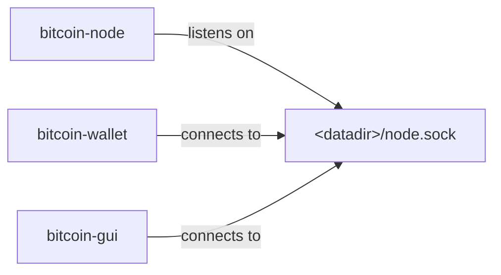
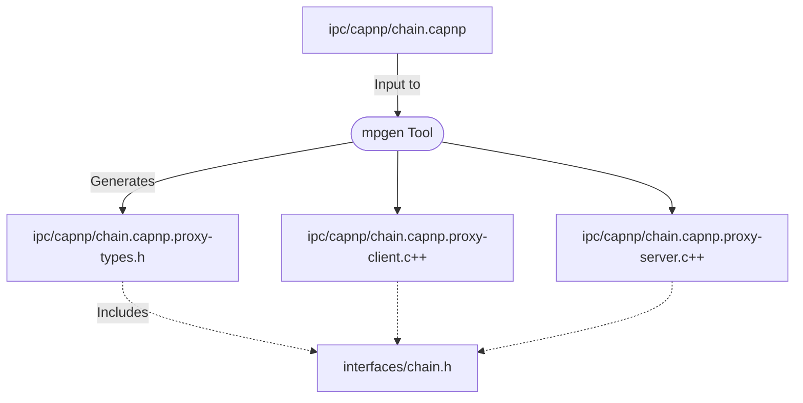
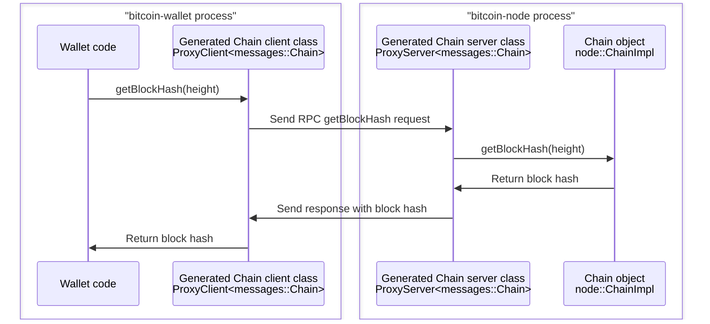

# Multiprocess Bitcoin Design Document

Guide to the design and architecture of the Bitcoin Core multiprocess feature

_This document describes the design of the multiprocess feature. For usage information, see the top-level [multiprocess.md](../multiprocess.md) file._

## Table of contents

- [Introduction](#introduction)
- [Current Architecture](#current-architecture)
- [Proposed Architecture](#proposed-architecture)
- [Component Overview: Navigating the IPC Framework](#component-overview-navigating-the-ipc-framework)
- [Design Considerations](#design-considerations)
  - [Selection of Cap’n Proto](#selection-of-capn-proto)
  - [Hiding IPC](#hiding-ipc)
  - [Interface Definition Maintenance](#interface-definition-maintenance)
  - [Interface Stability](#interface-stability)
- [Security Considerations](#security-considerations)
- [Example Use Cases and Flows](#example-use-cases-and-flows)
  - [Retrieving a Block Hash](#retrieving-a-block-hash)
- [Future Enhancements](#future-enhancements)
- [Conclusion](#conclusion)
- [Appendices](#appendices)
  - [Glossary of Terms](#glossary-of-terms)
  - [References](#references)
- [Acknowledgements](#acknowledgements)

## Introduction

The Bitcoin Core software has historically employed a monolithic architecture. The existing design has integrated functionality like P2P network operations, wallet management, and a GUI into a single executable. While effective, it has limitations in flexibility, security, and scalability. This project introduces changes that transition Bitcoin Core to a more modular architecture. It aims to enhance security, improve usability, and facilitate maintenance and development of the software in the long run.

## Current Architecture

The current system features two primary executables: `bitcoind` and `bitcoin-qt`. `bitcoind` combines a Bitcoin P2P node with an integrated JSON-RPC server, wallet, and indexes. `bitcoin-qt` extends this by incorporating a Qt-based GUI. This monolithic structure, although robust, presents challenges such as limited operational flexibility and increased security risks due to the tight integration of components.

## Proposed Architecture

The new architecture divides the existing code into three specialized executables:

- `bitcoin-node`: Manages the P2P node, indexes, and JSON-RPC server.
- `bitcoin-wallet`: Handles all wallet functionality.
- `bitcoin-gui`: Provides a standalone Qt-based GUI.

This modular approach is designed to enhance security through component isolation and improve usability by allowing independent operation of each module. This allows for new use-cases, such as running the node on a dedicated machine and operating wallets and GUIs on separate machines with the flexibility to start and stop them as needed.

This subdivision could be extended in the future. For example, indexes could be removed from the `bitcoin-node` executable and run in separate executables. And JSON-RPC servers could be added to wallet and index executables, so they can listen and respond to RPC requests on their own ports, without needing to forward RPC requests through `bitcoin-node`.

<table><tr><td>

</td></tr><tr><td>
Processes and socket connection.
</td></tr></table>

## Component Overview: Navigating the IPC Framework

This section describes the major components of the Inter-Process Communication (IPC) framework covering the relevant source files, generated files, tools, and libraries.

### Abstract C++ Classes in [`src/interfaces/`](../../src/interfaces/)
- The foundation of the IPC implementation lies in the abstract C++ classes within the [`src/interfaces/`](../../src/interfaces/) directory. These classes define pure virtual methods that code in [`src/node/`](../../src/node/), [`src/wallet/`](../../src/wallet/), and [`src/qt/`](../../src/qt/) directories call to interact with each other.
- Each abstract class in this directory represents a distinct interface that the different modules (node, wallet, GUI) implement and use for cross-process communication.
- The classes are written following conventions described in [Internal Interface
  Guidelines](../developer-notes.md#internal-interface-guidelines) to ensure
  compatibility with Cap'n Proto.

### Cap’n Proto Files in [`src/ipc/capnp/`](../../src/ipc/capnp/)
- Corresponding to each abstract class, there are `.capnp` files within the [`src/ipc/capnp/`](../../src/ipc/capnp/) directory. These files are used as input to the `mpgen` tool (described below) to generate C++ code.
- These Cap’n Proto files ([learn more about Cap'n Proto RPC](https://capnproto.org/rpc.html)) define the structure and format of messages that are exchanged over IPC. They serve as blueprints for generating C++ code that bridges the gap between high-level C++ interfaces and low-level socket communication.

### The `mpgen` Code Generation Tool
- A central component of the IPC framework is the `mpgen` tool which is part the [`libmultiprocess` project](https://github.com/chaincodelabs/libmultiprocess). This tool takes the `.capnp` files as input and generates C++ code.
- The generated code handles IPC communication, translating interface calls into socket reads and writes.

### C++ Client Subclasses in Generated Code
- In the generated code, we have C++ client subclasses that inherit from the abstract classes in [`src/interfaces/`](../../src/interfaces/). These subclasses are the workhorses of the IPC mechanism.
- They implement all the methods of the interface, marshalling arguments into a structured format, sending them as requests to the IPC server via a UNIX socket, and handling the responses.
- These subclasses effectively mask the complexity of IPC, presenting a familiar C++ interface to developers.
- Internally, the client subclasses generated by the `mpgen` tool wrap [client classes generated by Cap'n Proto](https://capnproto.org/cxxrpc.html#clients), and use them to send IPC requests. The Cap'n Proto client classes are low-level, with non-blocking methods that use asynchronous I/O and pass request and response objects, while mpgen client subclasses provide normal C++ methods that block while executing and convert between request/response objects and arguments/return values.

### C++ Server Classes in Generated Code
- On the server side, corresponding generated C++ classes receive IPC requests. These server classes are responsible for unmarshalling method arguments, invoking the corresponding methods in the local [`src/interfaces/`](../../src/interfaces/) objects, and creating the IPC response.
- The server classes ensure that return values (including output argument values and thrown exceptions) are marshalled and sent back to the client, completing the communication cycle.
- Internally, the server subclasses generated by the `mpgen` tool inherit from [server classes generated by Cap'n Proto](https://capnproto.org/cxxrpc.html#servers), and use them to process IPC requests.

### The `libmultiprocess` Runtime Library
- **Core Functionality**: The `libmultiprocess` runtime library's primary function is to instantiate the generated client and server classes as needed.
- **Bootstrapping IPC Connections**: It provides functions for starting new IPC connections, specifically binding generated client and server classes for an initial `interfaces::Init` interface (defined in [`src/interfaces/init.h`](../../src/interfaces/init.h)) to a UNIX socket. This initial interface has methods returning other interfaces that different Bitcoin Core modules use to communicate after the bootstrapping phase.
- **Asynchronous I/O and Thread Management**: The library is also responsible for managing I/O and threading. Particularly, it ensures that IPC requests never block each other and that new threads on either side of a connection can always make client calls. It also manages worker threads on the server side of calls, ensuring that calls from the same client thread always execute on the same server thread (to avoid locking issues and support nested callbacks).

### Type Hooks in [`src/ipc/capnp/*-types.h`](../../src/ipc/capnp/)
- **Custom Type Conversions**: In [`src/ipc/capnp/*-types.h`](../../src/ipc/capnp/), function overloads of `libmultiprocess` C++ functions, `mp::CustomReadField`, `mp::CustomBuildField`, `mp::CustomReadMessage` and `mp::CustomBuildMessage`, are defined. These overloads are used for customizing the conversion of specific C++ types to and from Cap’n Proto types.
- **Handling Special Cases**: The `mpgen` tool and `libmultiprocess` library can convert most C++ types to and from Cap’n Proto types automatically, including interface types, primitive C++ types, standard C++ types like `std::vector`, `std::set`, `std::map`, `std::tuple`, and `std::function`, as well as simple C++ structs that consist of aforementioned types and whose fields correspond 1:1 with Cap’n Proto struct fields. For other types, `*-types.h` files provide custom code to convert between C++ and Cap’n Proto data representations.

### Protocol-Agnostic IPC Code in [`src/ipc/`](../../src/ipc/)
- **Broad Applicability**: Unlike the Cap’n Proto-specific code in [`src/ipc/capnp/`](../../src/ipc/capnp/), the code in the [`src/ipc/`](../../src/ipc/) directory is protocol-agnostic. This enables potential support for other protocols, such as gRPC or a custom protocol in the future.
- **Process Management and Socket Operations**: The main purpose of this component is to provide functions for spawning new processes and creating and connecting to UNIX sockets.
- **ipc::Exception Class**: This code also defines an `ipc::Exception` class which is thrown from the generated C++ client class methods when there is an unexpected IPC error, such as a disconnection.

<table><tr><td>

</td></tr><tr><td>
Diagram showing generated source files and includes.
</td></tr></table>

## Design Considerations

### Selection of Cap’n Proto
The choice to use [Cap’n Proto](https://capnproto.org/) for IPC was primarily influenced by its support for passing object references and managing object lifetimes, which would have to be implemented manually with a framework that only supported plain requests and responses like [gRPC](https://grpc.io/). The support is especially helpful for passing callback objects like `std::function` and enabling bidirectional calls between processes.

The choice to use an RPC framework at all instead of a custom protocol was necessitated by the size of Bitcoin Core internal interfaces which consist of around 150 methods that pass complex data structures and are called in complicated ways (in parallel, and from callbacks that can be nested and stored). Writing a custom protocol to wrap these complicated interfaces would be a lot more work, akin to writing a new RPC framework.

### Hiding IPC

The IPC mechanism is deliberately isolated from the rest of the codebase so less code has to be concerned with IPC.

Building Bitcoin Core with IPC support is optional, and node, wallet, and GUI code can be compiled to either run in the same process or separate processes. The build system also ensures Cap’n Proto library headers can only be used within the [`src/ipc/capnp/`](../../src/ipc/capnp/) directory, not in other parts of the codebase.

The libmultiprocess runtime is designed to place as few constraints as possible on IPC interfaces and to make IPC calls act like normal function calls. Method arguments, return values, and exceptions are automatically serialized and sent between processes. Object references and `std::function` arguments are tracked to allow invoked code to call back into invoking code at any time. And there is a 1:1 threading model where every client thread has a corresponding server thread responsible for executing incoming calls from that thread (there can be multiple calls from the same thread due to callbacks) without blocking, and holding the same thread-local variables and locks so behavior is the same whether IPC is used or not.

### Interface Definition Maintenance

The choice to maintain interface definitions and C++ type mappings as `.capnp` files in the [`src/ipc/capnp/`](../../src/ipc/capnp/) was mostly done for convenience, and probably something that could be improved in the future.

In the current design, class names, method names, and parameter names are duplicated between C++ interfaces in [`src/interfaces/`](../../src/interfaces/) and Cap’n Proto files in [`src/ipc/capnp/`](../../src/ipc/capnp/). While this keeps C++ interface headers simple and free of references to IPC, it is a maintenance burden because it means inconsistencies between C++ declarations and Cap’n Proto declarations will result in compile errors. (Static type checking ensures these are not runtime errors.)

An alternate approach could use custom [C++ Attributes](https://en.cppreference.com/w/cpp/language/attributes) embedded in interface declarations to automatically generate `.capnp` files from C++ headers. This has not been pursued because parsing C++ headers is more complicated than parsing Cap’n Proto interface definitions, especially portably on multiple platforms.

In the meantime, the developer guide [Internal interface guidelines](../developer-notes.md#internal-interface-guidelines) can provide guidance on keeping interfaces consistent and functional and avoiding compile errors.

### Interface Stability

The currently defined IPC interfaces are unstable, and can change freely with no backwards compatibility. The decision to allow this stems from the recognition that our current interfaces are still evolving and not yet ideal for external use. As these interfaces mature and become more refined, there may be an opportunity to declare them stable and use Cap’n Proto's support for protocol evolution ([Cap'n Proto - Evolving Your Protocol](https://capnproto.org/language.html#evolving-your-protocol)) to allow them to be extended while remaining backwards compatible. This could allow different versions of node, GUI, and wallet binaries to interoperate, and potentially open doors for external tools to utilize these interfaces, such as creating custom indexes through a stable indexing interface. However, for now, the priority is to improve the interfaces internally. Given their current state and the advantages of using JSON-RPC for most common tasks, it's more practical to focus on internal development rather than external applicability.

## Security Considerations

The integration of [Cap’n Proto](https://capnproto.org/) and [libmultiprocess](https://github.com/chaincodelabs/libmultiprocess) into the Bitcoin Core architecture increases its potential attack surface. Cap’n Proto, being a complex and substantial new dependency, introduces potential sources of vulnerability, particularly through the creation of new UNIX sockets. The inclusion of libmultiprocess, while a smaller external dependency, also contributes to this risk. However, plans are underway to incorporate libmultiprocess as a git subtree, aligning it more closely with the project's well-reviewed internal libraries. While adopting these multiprocess features does introduce some risk, it's worth noting that they can be disabled, allowing builds without these new dependencies. This flexibility ensures that users can balance functionality with security considerations as needed.

## Example Use Cases and Flows

### Retrieving a Block Hash

Let’s walk through an example where the `bitcoin-wallet` process requests the hash of a block at a specific height from the `bitcoin-node` process. This example demonstrates the practical application of the IPC mechanism, specifically the interplay between C++ method calls and Cap’n Proto-generated RPC calls.

<table><tr><td>

</td></tr><tr><td>
<code>Chain::getBlockHash</code> call diagram
</td></tr></table>

1. **Initiation in bitcoin-wallet**
   - The wallet process calls the `getBlockHash` method on a `Chain` object. This method is defined as a virtual method in [`src/interfaces/chain.h`](../../src/interfaces/chain.h).

2. **Translation to Cap’n Proto RPC**
   - The `Chain::getBlockHash` virtual method is overridden by the `Chain` [client subclass](#c-client-subclasses-in-generated-code) to translate the method call into a Cap’n Proto RPC call.
   - The client subclass is automatically generated by the `mpgen` tool from the [`chain.capnp`](https://github.com/ryanofsky/bitcoin/blob/pr/ipc/src/ipc/capnp/chain.capnp) file in [`src/ipc/capnp/`](../../src/ipc/capnp/).

3. **Request Preparation and Dispatch**
   - The `getBlockHash` method of the generated `Chain` client subclass in `bitcoin-wallet` populates a Cap’n Proto request with the `height` parameter, sends it to `bitcoin-node` process, and waits for a response.

4. **Handling in bitcoin-node**
   - Upon receiving the request, the Cap'n Proto dispatching code in the `bitcoin-node` process calls the `getBlockHash` method of the `Chain` [server class](#c-server-classes-in-generated-code).
   - The server class is automatically generated by the `mpgen` tool from the [`chain.capnp`](https://github.com/ryanofsky/bitcoin/blob/pr/ipc/src/ipc/capnp/chain.capnp) file in [`src/ipc/capnp/`](../../src/ipc/capnp/).
   - The `getBlockHash` method of the generated `Chain` server subclass in `bitcoin-wallet` receives a Cap’n Proto request object with the `height` parameter, and calls the `getBlockHash` method on its local `Chain` object with the provided `height`.
   - When the call returns, it encapsulates the return value in a Cap’n Proto response, which it sends back to the `bitcoin-wallet` process.

5. **Response and Return**
   - The `getBlockHash` method of the generated `Chain` client subclass in `bitcoin-wallet` which sent the request now receives the response.
   - It extracts the block hash value from the response, and returns it to the original caller.

## Future Enhancements

Further improvements are possible such as:

- Separating indexes from `bitcoin-node`, and running indexing code in separate processes (see [indexes: Stop using node internal types #24230](https://github.com/bitcoin/bitcoin/pull/24230)).
- Enabling wallet processes to listen for JSON-RPC requests on their own ports instead of needing the node process to listen and forward requests to them.
- Automatically generating `.capnp` files from C++ interface definitions (see [Interface Definition Maintenance](#interface-definition-maintenance)).
- Simplifying and stabilizing interfaces (see [Interface Stability](#interface-stability)).
- Adding sandbox features, restricting subprocess access to resources and data (see [https://eklitzke.org/multiprocess-bitcoin](https://eklitzke.org/multiprocess-bitcoin)).
- Using Cap'n Proto's support for [other languages](https://capnproto.org/otherlang.html), such as [Rust](https://github.com/capnproto/capnproto-rust), to allow code written in other languages to call Bitcoin Core C++ code, and vice versa (see [How to rustify libmultiprocess? #56](https://github.com/chaincodelabs/libmultiprocess/issues/56)).

## Conclusion

This modularization represents an advancement in Bitcoin Core's architecture, offering enhanced security, flexibility, and maintainability. The project invites collaboration and feedback from the community.

## Appendices

### Glossary of Terms

- **abstract class**: A class in C++ that consists of virtual functions. In the Bitcoin Core project, they define interfaces for inter-component communication.

- **asynchronous I/O**: A form of input/output processing that allows a program to continue other operations while a transmission is in progress.

- **Cap’n Proto**: A high-performance data serialization and RPC library, chosen for its support for object references and bidirectional communication.

- **Cap’n Proto interface**: A set of methods defined in Cap’n Proto to facilitate structured communication between different software components.

- **Cap’n Proto struct**: A structured data format used in Cap’n Proto, similar to structs in C++, for organizing and transporting data across different processes.

- **client class (in generated code)**: A C++ class generated from a Cap’n Proto interface which inherits from a Bitcoin Core abstract class, and implements each virtual method to send IPC requests to another process. (see also [components section](#c-client-subclasses-in-generated-code))

- **IPC (inter-process communication)**: Mechanisms that enable processes to exchange requests and data.

- **ipc::Exception class**: A class within Bitcoin Core's protocol-agnostic IPC code that is thrown by client class methods when there is an IPC error.

- **libmultiprocess**: A custom library and code generation tool used for creating IPC interfaces and managing IPC connections.

- **marshalling**: Transforming an object’s memory representation for transmission.

- **mpgen tool**: A tool within the `libmultiprocess` suite that generates C++ code from Cap’n Proto files, facilitating IPC.

- **protocol-agnostic code**: Generic IPC code in [`src/ipc/`](../../src/ipc/) that does not rely on Cap’n Proto and could be used with other protocols. Distinct from code in [`src/ipc/capnp/`](../../src/ipc/capnp/) which relies on Cap’n Proto.

- **RPC (remote procedure call)**: A protocol that enables a program to request a service from another program in a different address space or network. Bitcoin Core uses [JSON-RPC](https://en.wikipedia.org/wiki/JSON-RPC) for RPC.

- **server class (in generated code)**: A C++ class generated from a Cap’n Proto interface which handles requests sent by a _client class_ in another process. The request handled by calling a local Bitcoin Core interface method, and the return values (if any) are sent back in a response. (see also: [components section](#c-server-classes-in-generated-code))

- **unix socket**: Communication endpoint which is a filesystem path, used for exchanging data between processes running on the same host.

- **virtual method**: A function or method whose behavior can be overridden within an inheriting class by a function with the same signature.

## References

- **Cap’n Proto RPC protocol description**: https://capnproto.org/rpc.html
- **libmultiprocess project page**: https://github.com/chaincodelabs/libmultiprocess

## Acknowledgements

This design doc was written by @ryanofsky, who is grateful to all the reviewers who gave feedback and tested [multiprocess PRs](https://github.com/bitcoin/bitcoin/pull/28722), and everyone else who's helped with this project. Particular thanks to @ariard who deeply reviewed IPC code and improved the design of the IPC library and initialization process. @jnewbery who championed the early refactoring PRs and helped guide them through development and review. @sjors who has reviewed and repeatedly tested multiprocess code, reporting many issues and helping debug them. @hebasto, @fanquake, and @maflcko who made significant improvements to the build system and fixed countless build issues. @vasild and @jamesob who were brave contributors to the libmultiprocess library. And Chaincode Labs for making this work possible. Also thanks to ChatGPT, who actually wrote most of this document (not @ryanofsky).
