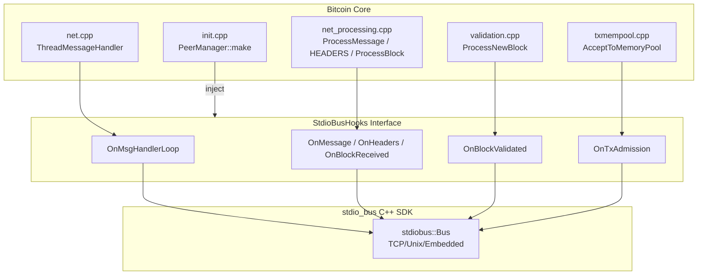

# stdio_bus Integration Design Document

## Overview

This document describes the integration of stdio_bus into Bitcoin Core for performance optimization and security research. The integration follows Bitcoin Core's contribution guidelines and maintains consensus safety.

## Goals

1. **Performance Optimization**: Address issues #21803, #27623, #27677, #18678
2. **Security Research**: Enable controlled message delivery for vulnerability discovery
3. **Observability**: Shadow-mode telemetry without affecting consensus

## Non-Goals

- Modifying consensus logic
- Changing P2P protocol semantics
- Breaking backward compatibility

## Architecture

### Integration Points



**StdioBusHooks properties:**
- Shadow mode only (observe, don't modify)
- Non-blocking callbacks
- Bounded queue for async processing
- Fail-open on errors

### Feature Flag

```
-stdiobus=<mode>    Enable stdio_bus integration
                    off     - Disabled (default)
                    shadow  - Observe only, no behavior change
                    active  - Enable optimizations (future)
```

## Baseline Metrics

### #21803: Block Processing Delays

| Metric | Description | Sampling Point |
|--------|-------------|----------------|
| `block_announce_to_process_start_ms` | Time from HEADERS/CMPCTBLOCK to ProcessBlock entry | HEADERS branch → ProcessBlock |
| `block_request_to_receive_ms` | Time from GETDATA to BLOCK/BLOCKTXN received | BlockRequested → block received |
| `block_receive_to_accept_ms` | Time from ProcessBlock to ProcessNewBlock complete | ProcessBlock → ProcessNewBlock |
| `inflight_block_count` | Blocks in-flight per peer | BlockRequested tracking |
| `peer_selection_churn` | Times block source was re-selected | Peer selection logic |

### #27623: Message Handler Saturation

| Metric | Description | Sampling Point |
|--------|-------------|----------------|
| `msghand_loop_cycle_ms` | Duration of ThreadMessageHandler iteration | Loop start/end |
| `process_message_cpu_ms` | CPU time per ProcessMessage by msg_type | ProcessMessage entry/exit |
| `message_queue_wait_ms` | Time message waited in queue | Queue entry → ProcessMessage |
| `headers_parse_ms` | Headers deserialization time | HEADERS parsing |
| `block_parse_ms` | Block deserialization time | BLOCK parsing |
| `msghand_cpu_utilization_pct` | CPU utilization of msghand thread | perf/tracepoints |

### #27677: Mempool Performance

| Metric | Description | Sampling Point |
|--------|-------------|----------------|
| `tx_admission_latency_ms` | Time from TX received to AcceptToMemoryPool result | TX received → ATMP complete |
| `tx_admission_throughput_tps` | Transactions per second through admission | Counter over time window |
| `mempool_lock_wait_ms` | Lock contention on mempool.cs, cs_main | Lock acquire timing |
| `package_accept_latency_ms` | Package validation latency | ProcessNewPackage |
| `mempool_eviction_rate` | Evictions per second | TrimToSize/Expire |

### #18678: P2P/RPC Degradation

| Metric | Description | Sampling Point |
|--------|-------------|----------------|
| `rpc_latency_ms` | RPC latency by method (P50/P95/P99) | RPC entry/exit |
| `rpc_qps_sustained` | Sustained QPS under P2P load | RPC counter |
| `p2p_rpc_interference` | RPC latency increase vs P2P throughput | Correlation analysis |
| `http_queue_depth` | HTTP server queue depth | HTTP server |
| `eventloop_delay_ms` | Delay between network receive and RPC response | Event loop timing |

## Event Log Format

All events are logged in NDJSON format with monotonic timestamps:

```json
{"ts_us": 1234567890123, "event": "headers_received", "peer_id": 42, "count": 2000, "first_prev": "00000..."}
{"ts_us": 1234567890456, "event": "block_requested", "peer_id": 42, "hash": "00000...", "height": 800000}
{"ts_us": 1234567891234, "event": "block_validated", "hash": "00000...", "height": 800000, "duration_us": 778}
{"ts_us": 1234567892000, "event": "tx_admitted", "txid": "abc123...", "duration_us": 1234, "result": "accepted"}
{"ts_us": 1234567893000, "event": "rpc_call", "method": "getblockchaininfo", "duration_us": 567}
```

## Event Schema (v1.0)

Stable event schema for baseline comparisons. All timestamps are monotonic microseconds.

### MessageEvent
| Field | Type | Description |
|-------|------|-------------|
| `peer_id` | int64 | Node ID of the peer |
| `msg_type` | string | P2P message type (e.g., "headers", "block", "tx") |
| `size_bytes` | size_t | Message size in bytes |
| `received_us` | int64 | Monotonic timestamp when received |

### HeadersEvent
| Field | Type | Description |
|-------|------|-------------|
| `peer_id` | int64 | Node ID of the peer |
| `count` | size_t | Number of headers in message |
| `first_prev_hash` | uint256 | Previous block hash of first header |
| `received_us` | int64 | Monotonic timestamp when received |

### BlockReceivedEvent
| Field | Type | Description |
|-------|------|-------------|
| `peer_id` | int64 | Node ID of the peer |
| `hash` | uint256 | Block hash |
| `height` | int | Block height (-1 if unknown) |
| `size_bytes` | size_t | Block size in bytes |
| `tx_count` | size_t | Number of transactions |
| `received_us` | int64 | Monotonic timestamp when received |

### BlockValidatedEvent
| Field | Type | Description |
|-------|------|-------------|
| `hash` | uint256 | Block hash |
| `height` | int | Block height |
| `tx_count` | size_t | Number of transactions |
| `received_us` | int64 | Monotonic timestamp when received |
| `validated_us` | int64 | Monotonic timestamp when validation completed |
| `accepted` | bool | Whether block was accepted |
| `reject_reason` | string | Rejection reason (empty if accepted) |

### TxAdmissionEvent
| Field | Type | Description |
|-------|------|-------------|
| `txid` | uint256 | Transaction ID |
| `wtxid` | uint256 | Witness transaction ID |
| `size_bytes` | size_t | Transaction size in bytes |
| `received_us` | int64 | Monotonic timestamp when received |
| `processed_us` | int64 | Monotonic timestamp when processed |
| `accepted` | bool | Whether transaction was accepted |
| `reject_reason` | string | Rejection reason (empty if accepted) |

### MsgHandlerLoopEvent
| Field | Type | Description |
|-------|------|-------------|
| `iteration` | int64 | Loop iteration counter |
| `start_us` | int64 | Monotonic timestamp at loop start |
| `end_us` | int64 | Monotonic timestamp at loop end |
| `messages_processed` | int | Number of messages processed |
| `had_work` | bool | Whether there was work to do |

### RpcCallEvent
| Field | Type | Description |
|-------|------|-------------|
| `method` | string | RPC method name |
| `start_us` | int64 | Monotonic timestamp at call start |
| `end_us` | int64 | Monotonic timestamp at call end |
| `success` | bool | Whether call succeeded |

## Consensus Safety Invariants

1. **No consensus decisions through stdio_bus** - All validation logic unchanged
2. **Async mechanisms don't affect acceptance** - Final result identical to baseline
3. **Fail-open on hook errors** - Return to standard path on any failure
4. **No modification of message content** - Hooks are read-only observers
5. **No lock inversion** - Hooks must not acquire locks held by callers
6. **No blocking I/O** - All hook callbacks must be non-blocking

## Lock and Latency Budget

### Latency Requirements

| Hook | Max Latency | Rationale |
|------|-------------|-----------|
| `OnMessage` | ≤100μs | Hot path in message handler loop |
| `OnHeaders` | ≤100μs | Called for every HEADERS message |
| `OnBlockReceived` | ≤500μs | Less frequent, larger event struct |
| `OnBlockValidated` | ≤500μs | Called from validation thread |
| `OnTxAdmission` | ≤100μs | High frequency during mempool activity |
| `OnMsgHandlerLoop` | ≤50μs | Called every loop iteration |
| `OnRpcCall` | ≤100μs | RPC latency sensitive |

**Total overhead target**: ≤1ms per message handler loop iteration in shadow mode.

### Lock Ordering Rules

Hooks are called while holding various locks. Implementations MUST NOT:

1. **Acquire `cs_main`** - Already held during validation hooks
2. **Acquire `m_peer_mutex`** - Already held during P2P hooks
3. **Acquire `mempool.cs`** - May be held during tx admission
4. **Perform blocking I/O** - Use bounded async queue instead
5. **Allocate unbounded memory** - Use pre-allocated buffers

### Recommended Implementation Pattern

```cpp
class StdioBusSdkHooks : public StdioBusHooks {
    // Bounded lock-free queue (SPSC or MPSC)
    BoundedQueue<Event, 4096> m_queue;
    
    // Background thread for I/O
    std::thread m_worker;
    
    void OnMessage(const MessageEvent& ev) override {
        // Fast path: try_push is lock-free, O(1)
        if (!m_queue.try_push(ev)) {
            // Queue full - drop event (fail-open)
            ++m_dropped_events;
        }
    }
};
```

### Fail-Open Behavior

On any error condition, hooks MUST fail silently and allow normal processing:

| Condition | Behavior |
|-----------|----------|
| Queue full | Drop event, increment counter |
| SDK error | Log debug, continue |
| Exception thrown | Catch, log, continue |
| Timeout | Skip event, continue |
| Memory allocation failure | Skip event, continue |

### Monitoring

Shadow mode should track:

- `stdio_bus_events_total` - Total events by type
- `stdio_bus_events_dropped` - Dropped events (queue full)
- `stdio_bus_hook_latency_us` - Hook callback latency histogram
- `stdio_bus_queue_depth` - Current queue depth

## Known Limitations (Phase 1)

1. **OnTxAdmission only covers successful admissions** - Rejections via `TransactionAddedToMempool` 
   are not captured. Full reject telemetry requires instrumentation in `AcceptToMemoryPool`.

2. **Block receive time approximation** - `BlockValidatedEvent.received_us` may equal 
   `validated_us` if block wasn't tracked through `OnBlockReceived` first.

3. **No RPC hooks yet** - `OnRpcCall` is defined but not wired in Phase 1.

## Test Requirements

Before merge, all changes must pass:
- `test_bitcoin` (unit tests)
- `test/functional/` (functional tests)
- Fuzz targets
- Sanitizers (ASan, UBSan, TSan)
- Performance regression check (baseline comparison)

## Implementation Phases

### Phase 0: Baseline (This Document)
- Define metrics and methodology
- Create perf harness
- Establish reproducible baseline

### Phase 1: Shadow Hooks
- StdioBusHooks interface
- Injection via PeerManager::Options
- Shadow-mode telemetry

### Phase 2-5: Optimizations
- Address specific issues with measured improvements
- Each optimization behind feature flag

### Phase 6: Security Research
- Controlled fault injection
- Race condition campaigns
- Differential testing

### Phase 7: Upstream
- PR stack preparation
- Documentation
- Review process

## References

- [#21803: Block processing delays](https://github.com/bitcoin/bitcoin/issues/21803)
- [#27623: CPU 100% message handling](https://github.com/bitcoin/bitcoin/issues/27623)
- [#27677: Mempool redesign](https://github.com/bitcoin/bitcoin/issues/27677)
- [#18678: P2P/RPC degradation](https://github.com/bitcoin/bitcoin/issues/18678)
- [Bitcoin Core Developer Notes](https://github.com/bitcoin/bitcoin/blob/master/doc/developer-notes.md)
