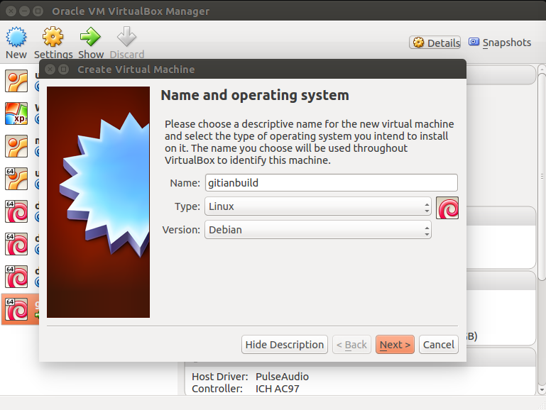
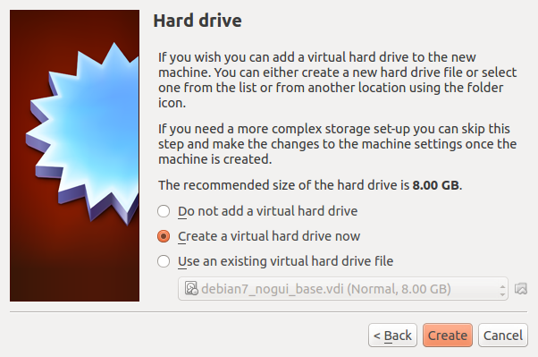
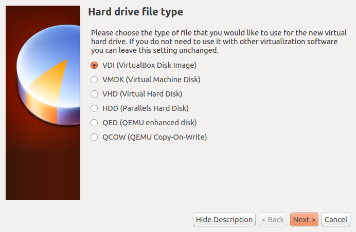
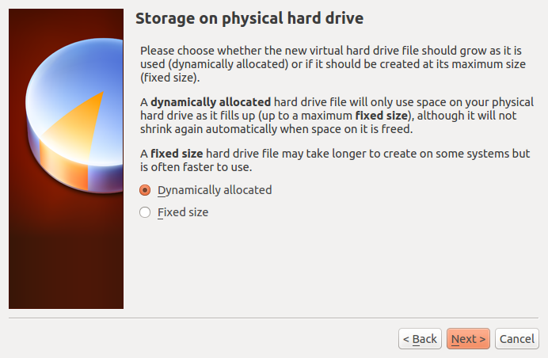
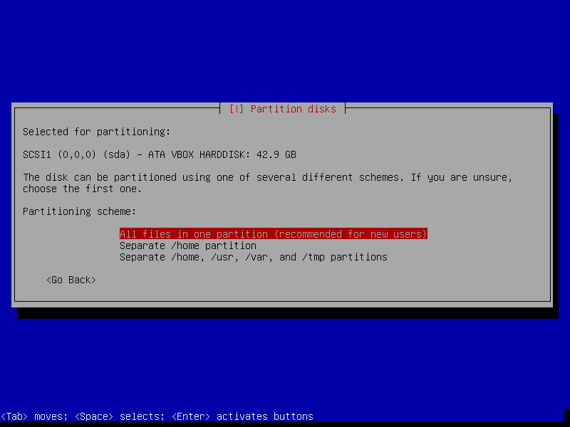
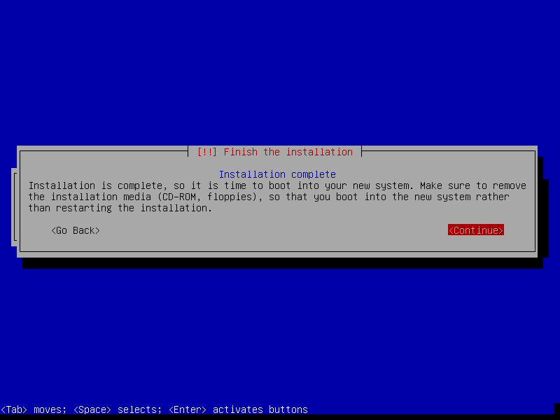

Gitian building
================

*Setup instructions for a gitian build of Bitcoin using a Debian VM or physical system.*

Gitian is the deterministic build process that is used to build the Bitcoin
Core executables. It provides a way to be reasonably sure that the
executables are really built from source on GitHub. It also makes sure that
the same, tested dependencies are used and statically built into the executable.

Multiple developers build the source code by following a specific descriptor
("recipe"), cryptographically sign the result, and upload the resulting signature.
These results are compared and only if they match, the build is accepted and uploaded
to bitcoin.org.

More independent gitian builders are needed, which is why I wrote this
guide. It is preferred to follow these steps yourself instead of using someone else's
VM image to avoid 'contaminating' the build.

Table of Contents
------------------

- [Create a new VirtualBox VM](#create-a-new-virtualbox-vm)
- [Connecting to the VM](#connecting-to-the-vm)
- [Setting up Debian for gitian building](#setting-up-debian-for-gitian-building)
- [Installing gitian](#installing-gitian)
- [Setting up gitian images](#setting-up-gitian-images)
- [Getting and building the inputs](#getting-and-building-the-inputs)
- [Building Bitcoin](#building-bitcoin)
- [Building an alternative repository](#building-an-alternative-repository)
- [Signing externally](#signing-externally)
- [Uploading signatures](#uploading-signatures)

Preparing the Gitian builder host
---------------------------------

The first step is to prepare the host environment that will be used to perform the Gitian builds.
This guide explains how to set up the environment, and how to start the builds.

Debian Linux was chosen as the host distribution because it has a lightweight install (in contrast to Ubuntu) and is readily available.
Any kind of virtualization can be used, for example:
- [VirtualBox](https://www.virtualbox.org/), covered by this guide
- [KVM](http://www.linux-kvm.org/page/Main_Page)
- [LXC](https://linuxcontainers.org/), see also [Gitian host docker container](https://github.com/gdm85/tenku/tree/master/docker/gitian-bitcoin-host/README.md).

You can also install on actual hardware instead of using virtualization.

Create a new VirtualBox VM
---------------------------
In the VirtualBox GUI click "Create" and choose the following parameters in the wizard:



- Type: Linux, Debian (64 bit)


- Memory Size: at least 1024MB, anything lower will really slow the build down



- Hard Drive: Create a virtual hard drive now
    


- Hard Drive file type: Use the default, VDI (VirtualBox Disk Image) 


    
- Storage on Physical hard drive: Dynamically Allocated 
    


- Disk size: at least 40GB; as low as 20GB *may* be possible, but better to err on the safe side 
- Push the `Create` button

Get the [Debian 7.4 net installer](http://ftp.at.debian.org/debian-jigdo/current/amd64/iso-cd/debian-7.4.0-amd64-netinst.iso) (a more recent minor version should also work, see also [Debian Network installation](https://www.debian.org/CD/netinst/)).
This DVD image can be validated using a SHA256 hashing tool, for example on
Unixy OSes by entering the following in a terminal:

    echo "b712a141bc60269db217d3b3e456179bd6b181645f90e4aac9c42ed63de492e9  debian-7.4.0-amd64-netinst.iso" | sha256sum -c
    # (must return OK)

After creating the VM, we need to configure it. 

- Click the `Settings` button, then go to the `Network` tab. Adapter 1 should be attached to `NAT`.


- Click `Advanced`, then `Port Forwarding`. We want to set up a port through where we can reach the VM to get files in and out.
- Create a new rule by clicking the plus icon.


- Set up the new rule the following way:
  - Name: `SSH`
  - Protocol: `TCP`
  - Leave Host IP empty
  - Host Port: `22222`
  - Leave Guest IP empty
  - Guest Port: `22`

- Click `Ok` twice to save.

Then start the VM. On the first launch you will be asked for a CD or DVD image. Choose the downloaded iso.


Installing Debian
------------------

In this section it will be explained how to install Debian on the newly created VM.

- Choose the non-graphical installer.  We do not need the graphical environment, it will only increase installation time and disk usage.


**Note**: Navigation in the Debian installer: To keep a setting at the default
and proceed, just press `Enter`. To select a different button, press `Tab`.

- Choose locale and keyboard settings (doesn't matter, you can just go with the defaults or select your own information)


- The VM will detect network settings using DHCP, this should all proceed automatically
- Configure the network: 
  - System name `debian`.
  - Leave domain name empty.


- Choose a root password and enter it twice (remember it for later) 


- Name the new user `debian` (the full name doesn't matter, you can leave it empty) 


- Choose a user password and enter it twice (remember it for later) 


- The installer will set up the clock using a time server, this process should be automatic
- Set up the clock: choose a time zone (depends on the locale settings that you picked earlier; specifics don't matter)  


- Disk setup
  - Partitioning method: Guided - Use the entire disk 
  


  - Select disk to partition: SCSI1 (0,0,0) 


  - Partitioning scheme: All files in one partition 
  


  - Finish partitioning and write changes to disk -> *Yes* (`Tab`, `Enter` to select the `Yes` button)

 


- The base system will be installed, this will take a minute or so
- Choose a mirror (any will do) 


- Enter proxy information (unless you are on an intranet, you can leave this empty)


- Wait a bit while 'Select and install software' runs
- Participate in popularity contest -> *No*
- Choose software to install. We need just the base system. 


- Make sure only 'SSH server' and 'Standard System Utilities' are checked
- Uncheck 'Debian Desktop Environment' and 'Print Server'


- Install the GRUB boot loader to the master boot record? -> Yes 



- Installation Complete -> *Continue*
- After installation, the VM will reboot and you will have a working Debian VM. Congratulations!

Connecting to the VM
----------------------

After the VM has booted you can connect to it using SSH, and files can be copied from and to the VM using a SFTP utility.
Connect to `localhost`, port `22222` (or the port configured when installing the VM).
On Windows you can use putty[1] and WinSCP[2].

For example to connect as `root` from a Linux command prompt use

    $ ssh root@localhost -p 22222
    The authenticity of host '[localhost]:22222 ([127.0.0.1]:22222)' can't be established.
    ECDSA key fingerprint is 8e:71:f9:5b:62:46:de:44:01:da:fb:5f:34:b5:f2:18.
    Are you sure you want to continue connecting (yes/no)? yes
    Warning: Permanently added '[localhost]:22222' (ECDSA) to the list of known hosts.
    root@localhost's password: (enter root password configured during install)
    Linux debian 3.2.0-4-amd64 #1 SMP Debian 3.2.54-2 x86_64
    root@debian:~#

Replace `root` with `debian` to log in as user.

[1] http://www.chiark.greenend.org.uk/~sgtatham/putty/download.html
[2] http://winscp.net/eng/index.php

Setting up Debian for gitian building
--------------------------------------

In this section we will be setting up the Debian installation for Gitian building.

First we need to log in as `root` to set up dependencies and make sure that our
user can use the sudo command. Type/paste the following in the terminal:

```bash
apt-get install git ruby sudo apt-cacher-ng qemu-utils debootstrap lxc python-cheetah parted kpartx bridge-utils
adduser debian sudo
```

When you get a colorful screen with a question about the 'LXC directory', just
go with the default (`/var/lib/lxc`).

Then set up LXC and the rest with the following, which is a complex jumble of settings and workarounds:

```bash
# the version of lxc-start in Debian 7.4 needs to run as root, so make sure
# that the build script can exectute it without providing a password
echo "%sudo ALL=NOPASSWD: /usr/bin/lxc-start" > /etc/sudoers.d/gitian-lxc
# add cgroup for LXC
echo "cgroup  /sys/fs/cgroup  cgroup  defaults  0   0" >> /etc/fstab
# make /etc/rc.local script that sets up bridge between guest and host
echo '#!/bin/sh -e' > /etc/rc.local
echo 'brctl addbr br0' >> /etc/rc.local
echo 'ifconfig br0 10.0.3.2/24 up' >> /etc/rc.local
echo 'exit 0' >> /etc/rc.local
# make sure that USE_LXC is always set when logging in as debian,
# and configure LXC IP addresses
echo 'export USE_LXC=1' >> /home/debian/.profile
echo 'export GITIAN_HOST_IP=10.0.3.2' >> /home/debian/.profile
echo 'export LXC_GUEST_IP=10.0.3.5' >> /home/debian/.profile
reboot
```

At the end the VM is rebooted to make sure that the changes take effect. The steps in this
section need only to be performed once.

Installing gitian
------------------

Re-login as the user `debian` that was created during installation.
The rest of the steps in this guide will be performed as that user.

There is no `python-vm-builder` package in Debian, so we need to install it from source ourselves,

```bash
wget http://archive.ubuntu.com/ubuntu/pool/universe/v/vm-builder/vm-builder_0.12.4+bzr489.orig.tar.gz
echo "ec12e0070a007989561bfee5862c89a32c301992dd2771c4d5078ef1b3014f03  vm-builder_0.12.4+bzr489.orig.tar.gz" | sha256sum -c
# (verification -- must return OK)
tar -zxvf vm-builder_0.12.4+bzr489.orig.tar.gz
cd vm-builder-0.12.4+bzr489
sudo python setup.py install
cd ..
```

**Note**: When sudo asks for a password, enter the password for the user *debian* not for *root*.

Clone the git repositories for bitcoin and gitian and then checkout the bitcoin version that you want to build.

```bash
git clone https://github.com/devrandom/gitian-builder.git
git clone https://github.com/bitcoin/bitcoin
cd bitcoin
git checkout v${VERSION}
cd ..
```

Setting up gitian images
-------------------------

Gitian needs virtual images of the operating system to build in.
Currently this is Ubuntu Precise for x86_64.
These images will be copied and used every time that a build is started to
make sure that the build is deterministic.
Creating the images will take a while, but only has to be done once.

Execute the following as user `debian`:

```bash
cd gitian-builder
bin/make-base-vm --lxc --arch amd64 --suite precise
```

There will be a lot of warnings printed during build of the images. These can be ignored.

**Note**: When sudo asks for a password, enter the password for the user *debian* not for *root*.

Getting and building the inputs
--------------------------------

Follow the instructions in [doc/release-process.md](release-process.md) in the bitcoin repository
under 'Fetch and build inputs' to install sources which require manual intervention. Also follow
the next step: 'Seed the Gitian sources cache', which will fetch all necessary source files allowing
for gitian to work offline.

Building Bitcoin
----------------

To build Bitcoin (for Linux, OSX and Windows) just follow the steps under 'perform
gitian builds' in [doc/release-process.md](release-process.md) in the bitcoin repository.

This may take a long time as it also builds the dependencies needed for each descriptor.
These dependencies will be cached after a successful build to avoid rebuilding them when possible.

At any time you can check the package installation and build progress with

```bash
tail -f var/install.log
tail -f var/build.log

Output from `gbuild` will look something like

    Initialized empty Git repository in /home/debian/gitian-builder/inputs/bitcoin/.git/
    remote: Reusing existing pack: 35606, done.
    remote: Total 35606 (delta 0), reused 0 (delta 0)
    Receiving objects: 100% (35606/35606), 26.52 MiB | 4.28 MiB/s, done.
    Resolving deltas: 100% (25724/25724), done.
    From https://github.com/bitcoin/bitcoin
    ... (new tags, new branch etc)
    --- Building for precise x86_64 ---
    Stopping target if it is up
    Making a new image copy
    stdin: is not a tty
    Starting target
    Checking if target is up
    Preparing build environment
    Updating apt-get repository (log in var/install.log)
    Installing additional packages (log in var/install.log)
    Grabbing package manifest
    stdin: is not a tty
    Creating build script (var/build-script)
    lxc-start: Connection refused - inotify event with no name (mask 32768)
    Running build script (log in var/build.log)

Building an alternative repository
-----------------------------------

If you want to do a test build of a pull on GitHub it can be useful to point
the gitian builder at an alternative repository, using the same descriptors
and inputs.

For example:
```bash
URL=https://github.com/laanwj/bitcoin.git
COMMIT=2014_03_windows_unicode_path
./bin/gbuild --commit bitcoin=${COMMIT} --url bitcoin=${URL} ../bitcoin/contrib/gitian-descriptors/gitian-linux.yml
./bin/gbuild --commit bitcoin=${COMMIT} --url bitcoin=${URL} ../bitcoin/contrib/gitian-descriptors/gitian-win.yml
./bin/gbuild --commit bitcoin=${COMMIT} --url bitcoin=${URL} ../bitcoin/contrib/gitian-descriptors/gitian-osx.yml
```

Signing externally
-------------------

If you want to do the PGP signing on another device that's also possible; just define `SIGNER` as mentioned
and follow the steps in the build process as normal.

    gpg: skipped "laanwj": secret key not available

When you execute `gsign` you will get an error from GPG, which can be ignored. Copy the resulting `.assert` files
in `gitian.sigs` to your signing machine and do

```bash
    gpg --detach-sign ${VERSION}-linux/${SIGNER}/bitcoin-build.assert
    gpg --detach-sign ${VERSION}-win/${SIGNER}/bitcoin-build.assert
    gpg --detach-sign ${VERSION}-osx/${SIGNER}/bitcoin-build.assert
```

This will create the `.sig` files that can be committed together with the `.assert` files to assert your
gitian build.

Uploading signatures
---------------------

After building and signing you can push your signatures (both the `.assert` and `.assert.sig` files) to the
[bitcoin/gitian.sigs](https://github.com/bitcoin/gitian.sigs/) repository, or if that's not possible create a pull
request. You can also mail the files to me (laanwj@gmail.com) and I'll commit them.
