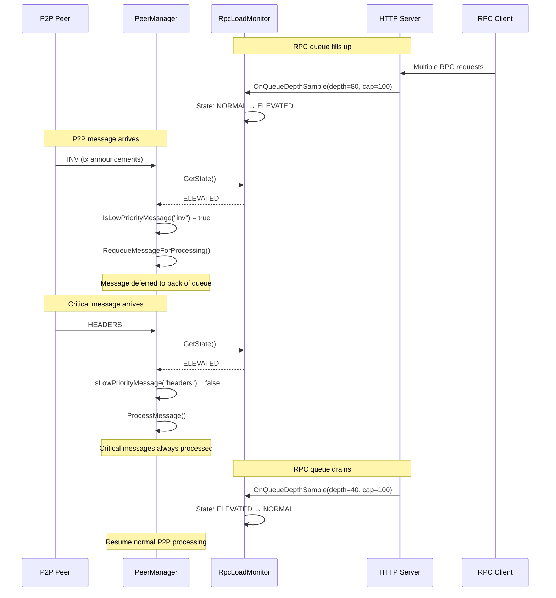
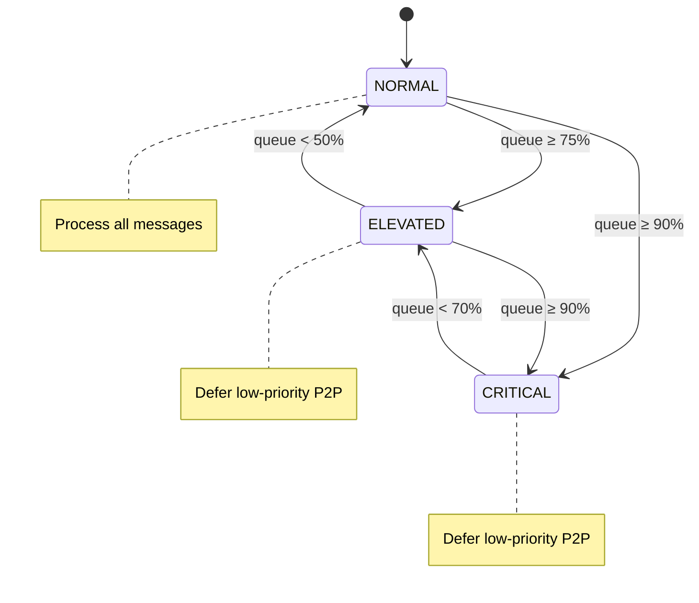

# PR: net_processing: add opt-in RPC-aware P2P backpressure gate

## Summary

Add an experimental backpressure mechanism that defers low-priority P2P message processing when the RPC work queue is under pressure, improving RPC tail latency under sustained P2P load.

## Problem

The single-threaded message handler (`-msghand` thread) processes all P2P messages sequentially. Under sustained low-priority P2P traffic (tx relay, addr gossip), RPC tail latency degrades significantly because:

1. **Single-threaded bottleneck** - The msghand thread can saturate a single CPU core at 100%, leaving other cores idle
2. **No priority differentiation** - Low-priority P2P messages (INV, TX, ADDR) compete equally with RPC work
3. **RPC starvation** - When RPC work queue fills up, new requests are rejected with "Work queue depth exceeded"

This affects users running RPC-heavy workloads (wallets, block explorers, Lightning nodes) alongside P2P relay.

## Solution

Introduce a minimal, opt-in backpressure policy:

### Request Flow



### Components

1. **RpcLoadMonitor** - A lock-free state machine that tracks RPC queue depth and exposes load state (`NORMAL`, `ELEVATED`, `CRITICAL`) with hysteresis to prevent oscillation.

2. **Backpressure Gate** - A check in `PeerManagerImpl::ProcessMessages()` that defers low-priority P2P messages when RPC load is elevated.

3. **Message Classification** - Clear separation between:
   - **Low-priority (deferrable):** `TX`, `INV` (tx), `GETDATA` (tx), `MEMPOOL`, `ADDR`, `ADDRV2`, `GETADDR`
   - **Critical (never throttled):** `HEADERS`, `BLOCK`, `CMPCTBLOCK`, `BLOCKTXN`, `GETHEADERS`, `GETBLOCKS`, handshake/control messages

4. **Defer-to-tail** - Deferred messages are requeued to the back of the peer's message queue, not dropped. This preserves eventual delivery while prioritizing RPC responsiveness.

## Changes

### New Files
- `src/node/rpc_load_monitor.h` - `RpcLoadState` enum, `RpcLoadMonitor` interface, `AtomicRpcLoadMonitor` implementation

### Modified Files
- `src/net_processing.h` - Add `experimental_rpc_priority` and `rpc_load_monitor` to `PeerManager::Options`
- `src/net_processing.cpp` - Backpressure gate in `ProcessMessages()`, `IsLowPriorityMessage()` helper
- `src/net.h` - Add `RequeueMessageForProcessing()` to `CNode`
- `src/net.cpp` - Implement `RequeueMessageForProcessing()`
- `src/httpserver.h` - Add `SetHttpServerRpcLoadMonitor()`
- `src/httpserver.cpp` - Call `OnQueueDepthSample()` at enqueue/dispatch points
- `src/node/peerman_args.cpp` - Parse `-experimental-rpc-priority` flag
- `src/init.cpp` - Create `RpcLoadMonitor`, wire to HTTP server and PeerManager

### New Flag
```
-experimental-rpc-priority=<0|1>  (default: 0)
    Enable experimental RPC-aware P2P backpressure policy.
    When enabled, low-priority P2P messages may be deferred
    during RPC queue overload to improve RPC latency.
```

## Policy Details

### State Machine



Hysteresis prevents rapid state oscillation under fluctuating load.

### Thresholds
| Transition | Condition |
|------------|-----------|
| NORMAL → ELEVATED | queue_depth ≥ 75% capacity |
| NORMAL → CRITICAL | queue_depth ≥ 90% capacity |
| ELEVATED → CRITICAL | queue_depth ≥ 90% capacity |
| ELEVATED → NORMAL | queue_depth < 50% capacity |
| CRITICAL → ELEVATED | queue_depth < 70% capacity |

### Behavior by State
| State | Low-priority P2P | Critical P2P | RPC |
|-------|------------------|--------------|-----|
| NORMAL | Process normally | Process normally | Process normally |
| ELEVATED | Defer to tail | Process normally | Process normally |
| CRITICAL | Defer to tail | Process normally | Process normally |

## Performance Results

A/B test with concurrent P2P INV flood (~108K entries) and RPC workload (12 threads, 45s duration):

### Baseline (flag=0)
| Metric | Value |
|--------|-------|
| RPC p50 | 1.925ms |
| RPC p95 | 9.320ms |
| RPC p99 | 17.974ms |
| RPC calls/sec | 3,919 |
| P2P INV msgs | 3,394 |

### With Policy (flag=1)
| Metric | Value |
|--------|-------|
| RPC p50 | 1.845ms |
| RPC p95 | 7.755ms |
| RPC p99 | 15.977ms |
| RPC calls/sec | 4,286 |
| P2P INV msgs | 3,372 |

### Improvement
| Metric | Change |
|--------|--------|
| RPC p50 | -4.2% (better) |
| RPC p95 | **-16.79%** (better) |
| RPC p99 | **-11.11%** (better) |
| Throughput | **+9.4%** |

## Testing

### Unit Tests (`src/test/rpc_load_monitor_tests.cpp`)
- `rpc_load_monitor_tests` suite (12 tests):
  - State transitions (normal→elevated→critical)
  - Hysteresis behavior
  - Thread safety
  - Edge cases (zero/negative capacity)
  - Custom threshold configuration

### Functional Test (`test/functional/feature_rpc_p2p_backpressure_ab.py`)
- A/B comparison with P2P INV flood workload
- Measures RPC latency percentiles (p50/p95/p99)
- Verifies no RPC errors under load
- Outputs JSON metrics for analysis

### Test Commands
```bash
# Unit tests
build/bin/test_bitcoin --run_test=rpc_load_monitor_tests

# Functional A/B test
python3 test/functional/feature_rpc_p2p_backpressure_ab.py
```

## Limitations and Future Work

1. **Experimental** - Feature is opt-in and may change based on feedback
2. **Overhead** - Without P2P pressure, policy adds ~1% overhead from state checks
3. **Tuning** - Threshold values are initial estimates; may need adjustment based on real-world data
4. **Message granularity** - Currently classifies by message type; could be refined to inspect INV/GETDATA contents

## Backwards Compatibility

- No consensus changes
- No P2P protocol changes
- No behavior change when flag is disabled (default)
- Existing tests pass

## Historical Context

This problem has been discussed in various forms:
- Mining pools (AntPool) reported ProcessMessage CPU saturation causing block delays
- Requests to split the msghand thread into multiple threads
- Analysis of CPU time spent in ProcessMessages() per peer

This PR provides a lightweight, opt-in mitigation without requiring architectural changes to the message handler threading model.
