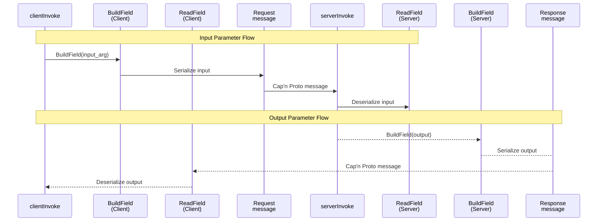
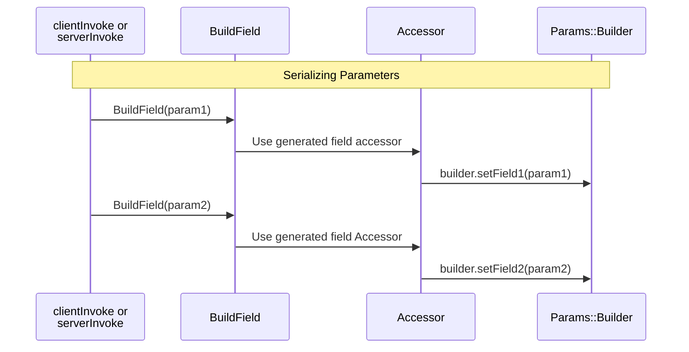
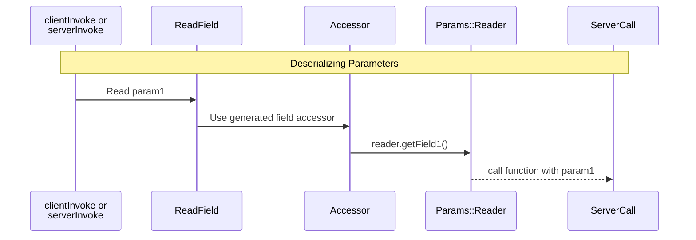
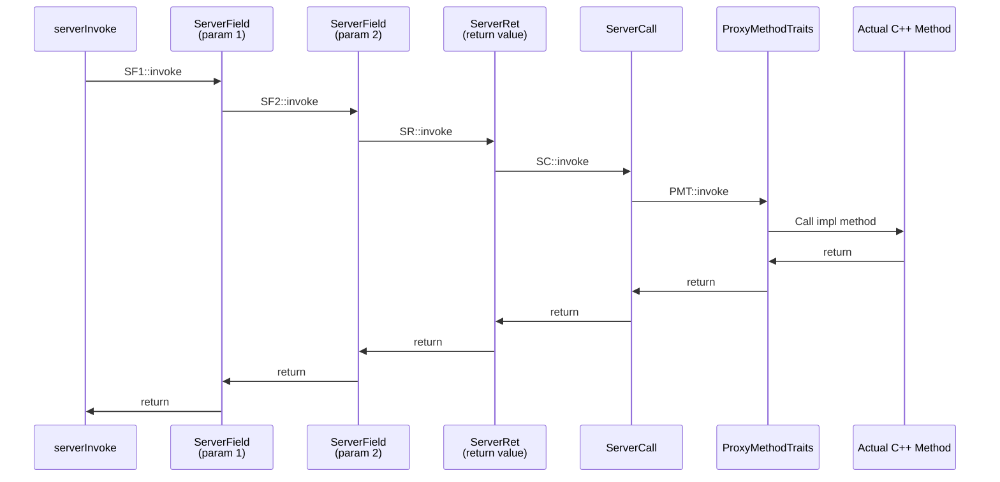
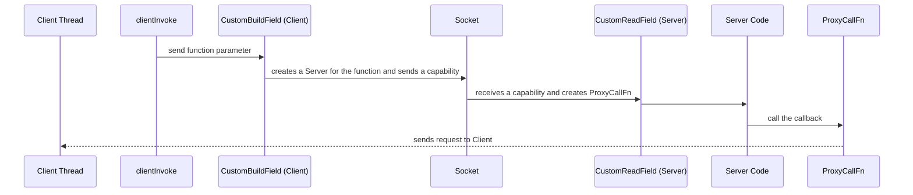

# libmultiprocess Design

Given an interface description of an object with one or more methods, libmultiprocess generates:

* A C++ `ProxyClient` class template specialization with an implementation of each interface method that sends a request over a socket, waits for a response, and returns the result.
* A C++ `ProxyServer` class template specialization that listens for requests over a socket and calls a wrapped C++ object implementing the same interface to actually execute the requests.

The function call ⇆ request translation supports input and output arguments, standard types like `unique_ptr`, `vector`, `map`, and `optional`, and bidirectional calls between processes through interface pointer and `std::function` arguments.

If the wrapped C++ object inherits from an abstract base class declaring virtual methods, the generated `ProxyClient` objects can inherit from the same class, allowing interprocess calls to replace local calls without changes to existing code.

There is also optional support for thread mapping, so each thread making interprocess calls can have a dedicated thread processing requests from it, and callbacks from processing threads are executed on corresponding request threads (so recursive mutexes and thread names function as expected in callbacks).

Libmultiprocess acts as a pure wrapper or layer over the underlying protocol. Clients and servers written in other languages, but using a shared capnproto schema can communicate with interprocess counterparties using libmultiprocess without having to use libmultiprocess themselves or having to know about the implementation details of libmultiprocess.

## Core Architecture

The `ProxyClient` and `ProxyServer` generated classes are not directly exposed to the user, as described in [usage.md](usage.md). Instead, they wrap C++ interfaces and appear to the user as pointers to an interface. They are first instantiated when calling `ConnectStream` and `ServeStream` respectively for creating the `InitInterface`. These methods establish connections through sockets, internally creating `Connection` objects wrapping a `capnp::RpcSystem` configured for client and server mode respectively.

The `InitInterface` interface will typically have methods which return other interfaces, giving the connecting process the ability to call other functions in the serving process. Interfaces can also have methods accepting other interfaces as parameters, giving serving processes the ability to call back and invoke functions in connecting processes. Creating new interfaces does not create new connections, and typically many interface objects will share the same connection.

Both `ConnectStream` and `ServeStream` also require an instantiation of the `EventLoop`. The `EventLoop` owns pending requests, notifies on request dispatch, allows clients from multiple threads to make synchronous calls, and handles some cleanup routines on exit. It must be run in a separate thread so it is always active and can process incoming requests from local clients and remote connections.

When a generated method on the `ProxyClient` is called, it calls `clientInvoke` with the capnp-translated types. `clientInvoke` creates a self-executing promise (`kj::TaskSet`) that drives the execution of the request and gives ownership of it to the `EventLoop`. `clientInvoke` blocks until a response is received, or until there is a call from the server that needs to run on the same client thread, using a `Waiter` object.

On the server side, the `capnp::RpcSystem` receives the capnp request and invokes the corresponding C++ method through the corresponding `ProxyServer` and the heavily templated `serverInvoke` triggering a `ServerCall`. The return values from the actual C++ methods are copied into capnp responses by `ServerRet` and exceptions are caught and copied by `ServerExcept`. The two are connected through `ServerField`. The main method driving execution of a request is `PassField`, which is invoked through `ServerField`. Instantiated interfaces, or capabilities in capnp speak, are tracked and owned by the server's `capnp::RpcSystem`.

## Request and Response Flow

Method parameters and return values are serialized using Cap'n Proto's Builder objects (for sending) and Reader objects (for receiving). Input parameters flow from the client to the server, while output parameters (return values) flow back from the server to the client.



### Detailed Serialization Mechanism

Parameters are represented as Fields that must be set on Cap'n Proto Builder objects (for sending) and read from Reader objects (for receiving).

#### Building Fields

`BuildField` uses a generated parameter `Accessor` to set the appropriate field in the Cap'n Proto Builder object.



#### Reading Fields

`ReadField` uses a generated parameter `Accessor` to read the appropriate field from the Cap'n Proto Reader object and reconstruct C++ parameters.



## Server-Side Request Processing

The generated server code uses a Russian nesting doll structure to process method fields. Each `ServerField` wraps another `ServerField` (for the next parameter), or wraps `ServerRet` (for the return value), which finally wraps `ServerCall` (which invokes the actual C++ method).

Each `ServerField` invokes `PassField`, which:
1. Calls `ReadField` to deserialize the parameter from the `Params::Reader`
2. Calls the next nested layer's `invoke()` with the accumulated parameters
3. Calls `BuildField` to serialize the parameter back if it's an output parameter

`ServerRet` invokes the next layer (typically `ServerCall`), stores the result, and calls `BuildField` to serialize it into the `Results::Builder`.

`ServerCall` uses the generated `ProxyMethod<MethodParams>::impl` pointer-to-member to invoke the actual C++ method on the wrapped implementation object.



## Advanced Features

### Callbacks

Callbacks (passed as `std::function` arguments) are intercepted by `CustomBuildField` and converted into Cap'n Proto capabilities that can be invoked across process boundaries. On the receiving end, `CustomReadField` intercepts the capability and constructs a `ProxyCallFn` object with an `operator()` that sends function calls back over the socket to invoke the original callback.



### Thread Mapping

Thread mapping enables each client thread to have a dedicated server thread processing its requests, preserving thread-local state and allowing recursive mutex usage across process boundaries.

Thread mapping is initialized by defining an interface method with a `ThreadMap` parameter and/or response. The example below adds `ThreadMap` to the `construct` method because libmultiprocess calls the `construct` method automatically.

```capnp
interface InitInterface $Proxy.wrap("Init") { 
    construct @0 (threadMap: Proxy.ThreadMap) -> (threadMap :Proxy.ThreadMap);
}
```

- **ThreadMap in parameter**: The client's `CustomBuildField` creates a `ThreadMap::Server` capability and sends it to the server, where `CustomReadField` stores the `ThreadMap::Client` in `connection.m_thread_map`
- **ThreadMap in response**: The server's `CustomBuildField` creates a `ThreadMap::Server` capability and sends it to the client, where `CustomReadField` stores the `ThreadMap::Client` in `connection.m_thread_map`

You can specify ThreadMap in the parameter only, response only, or both:
- **Parameter only**: Server can create threads on the client
- **Response only**: Client can create threads on the server
- **Both (as shown)**: Bidirectional thread creation

When both parameter and response include ThreadMap, both processes end up with `ThreadMap::Client` capabilities pointing to each other's `ThreadMap::Server`, allowing both sides to create threads on the other process.

### Async Processing with Context

By adding a `Context` parameter to a method in the capnp interface file, you enable async processing where the client tells the server to execute the request in a separate worker thread. For example:

```capnp
processData @5 (context :Proxy.Context, data :Data) -> (result :Result);
```

If a method does not have a `Context` parameter, then libmultiprocess will execute IPC requests invoking that method on the I/O event loop thread. This is fine for fast and non-blocking methods, but should be avoided for any methods that are slow or blocking or make any IPC calls(including callbacks to the client), since as long as the method is executing, the Cap'n Proto event loop will not be able to perform any I/O.

When a method has a `Context` parameter:

**Client side** (`CustomBuildField`):
If this is the first asynchronous request made from the current client thread, `CustomBuildField` will:
1. Call `connection.m_thread_map.makeThreadRequest()` to request a dedicated worker thread on the server (stored in `request_threads` map)
2. Set the remote thread capability in `Context.thread`
3. Create a local `Thread::Server` object for the current thread (stored in `callback_threads` map)
4. Set the local thread capability in `Context.callbackThread`

Subsequent requests will reuse the existing thread capabilities held in `callback_threads` and `request_threads`.

**Server side** (`PassField`):
1. Looks up the local `Thread::Server` object specified by `context.thread`
2. The worker thread:
   - Stores `context.callbackThread` in its `request_threads` map (so callbacks go to the right client thread)
   - Posts the work lambda to that thread's queue via `waiter->post(invoke)`
   - Cleans up the `request_threads` entry

## Interface Definitions

As explained in the [usage](usage.md) document, interface descriptions need to be consumed both by the _libmultiprocess_ code generator, and by C++ code that calls and implements the interfaces. The C++ code only needs to know about C++ arguments and return types, while the code generator only needs to know about capnp arguments and return types, but both need to know class and method names, so the corresponding `.h` and `.capnp` source files contain some of the same information, and have to be kept in sync manually when methods or parameters change. Despite the redundancy, reconciling the interface definitions is designed to be _straightforward_ and _safe_. _Straightforward_ because there is no need to write manual serialization code or use awkward intermediate types like [`UniValue`](https://github.com/bitcoin/bitcoin/blob/master/src/univalue/include/univalue.h) instead of native types. _Safe_ because if there are any inconsistencies between API and data definitions (even minor ones like using a narrow int data type for a wider int API input), there are errors at build time instead of errors or bugs at runtime.

In the future, it would be possible to combine API and data definitions together using [C++ attributes](https://en.cppreference.com/w/cpp/language/attributes). To do this we would add attributes to the API definition files, and then generate the data definitions from the API definitions and attributes. I didn't take this approach mostly because it would be extra work, but also because until C++ standardizes reflection, this would require either hooking into compiler APIs like https://github.com/RosettaCommons/binder, or parsing C++ code manually like http://www.swig.org/.

## What is `kj`?

KJ is a concurrency framework [bundled with
capnproto](https://capnproto.org/cxxrpc.html#kj-concurrency-framework); it is used as a
basis in this library to construct the event-loop necessary to service IPC requests.

## Future directions

_libmultiprocess_ uses the [Cap'n Proto](https://capnproto.org) interface description language and protocol, but it could be extended or changed to use a different IDL/protocol like [gRPC](https://grpc.io). The nice thing about _Cap'n Proto_ compared to _gRPC_ and most other lower level protocols is that it allows interface pointers (_Services_ in gRPC parlance) to be passed as method arguments and return values, so object references and bidirectional requests work out of the box. Supporting a lower-level protocol would require adding maps and tracking code to proxy objects.

_libmultiprocess_ is currently compatible with sandboxing but could add platform-specific sandboxing support or integration with a sandboxing library like [SAPI](https://github.com/google/sandboxed-api).
